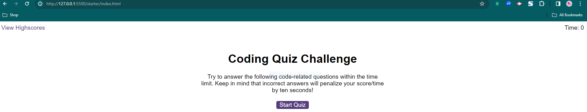

# Web-Developer-Quiz
Coding Quiz Challenge

Overview

It was an interesting and challenging project to create this quiz code. It required creating a dynamic quiz application with a timer, high score retention and responsive user interaction. The repository a unique name

Complexity

The task required attention to detail and a deep understanding of JavaScript, HTML and CSS. Each stage presented a specific set of problems that required a lot of research through trial and error.

Learning experience

This is the first time I've worked with multiple JavaScript and HTML files. This modular structure has added an extra layer of complexity and the need to have an understanding of the relationship between files.

When writing this project, I had to look for similar logic and syntax in other projects and try to apply it myself. Adding new variables and functions sometimes led to unexpected bugs. It took hours of debugging to find and fix them.

Application functionality

The final application is very similar to the mock-up functionality provided in the challenge instructions. However, there is no right/wrong answer function in my code. This provides an opportunity for future improvement and learning.

Challenges Faced

One of the biggest problems I faced was troubleshooting problems that occurred with each new addition to the code. Understanding the nuances of event handling, local storage, and dynamic HTML updates required constant reserch.

Screenshot 

The URL of the GitHub repository
https://github.com/RusLena/Web-Developer-Quiz.git

The URL of the functional, deployed application
https://ruslena.github.io/Web-Developer-Quiz/
